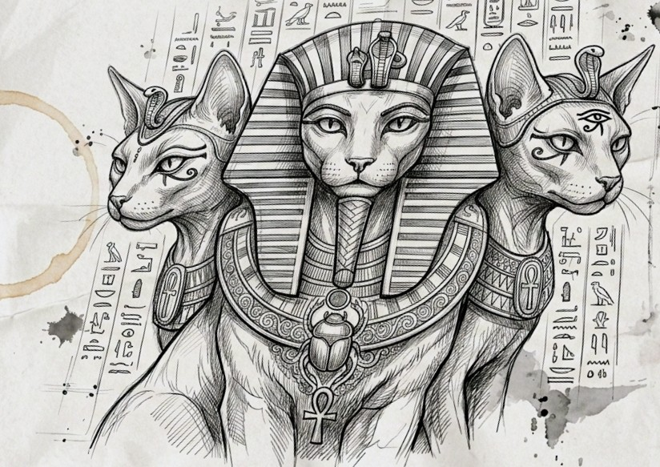

<Doctype html>
  <html>
<body>
  <button> 
satoshi
</button>
<button>
  chocolate
</button>

  HELLO WORLD, I'm Satoshi

<a href = "https://www.google.com">
  search with google
</a>

 

<a href = "https://www.amazon.com">
back to amazon
</a>

  Nike Black Running Shoes

  This is Tahoma Font

  Biggest Deals of the Year!

  Sales end Tuesday

Shopping for your business?

See how apple at work can help.

Learn more > 

    $39-in stock

Free delivery tomorrow.

<button class = "add">Add to Cart</button>
<button class = "bot">Buy now</button>
</body>
<head>

</head>
 </html>
</Doctype>
